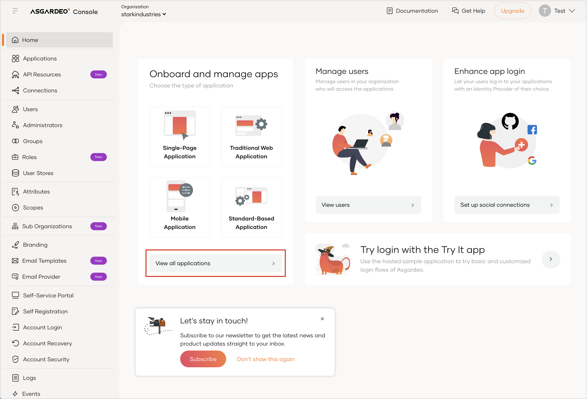
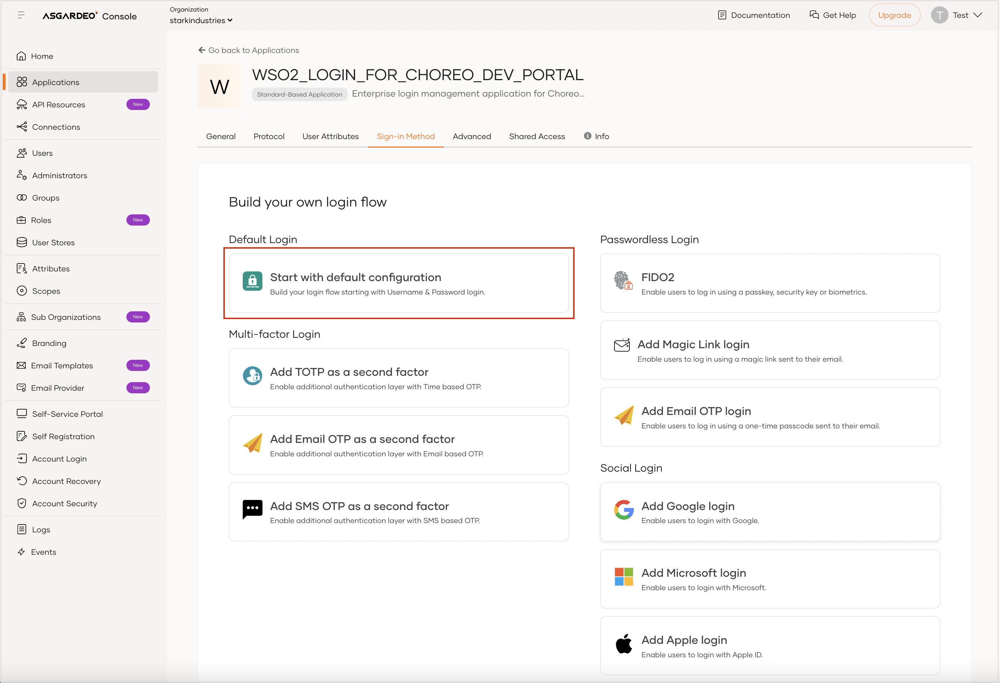
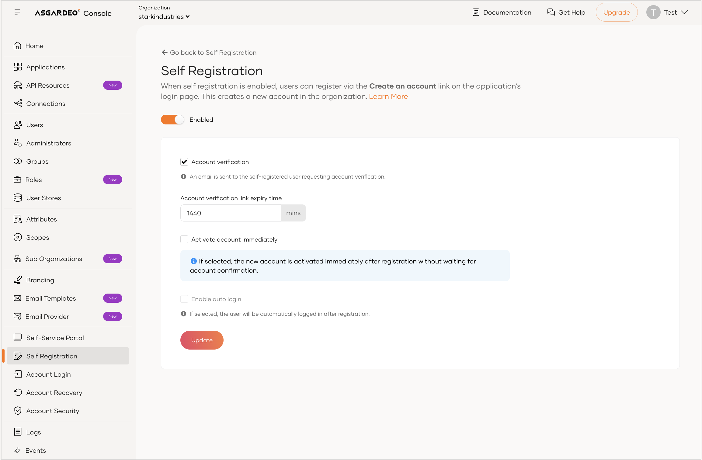
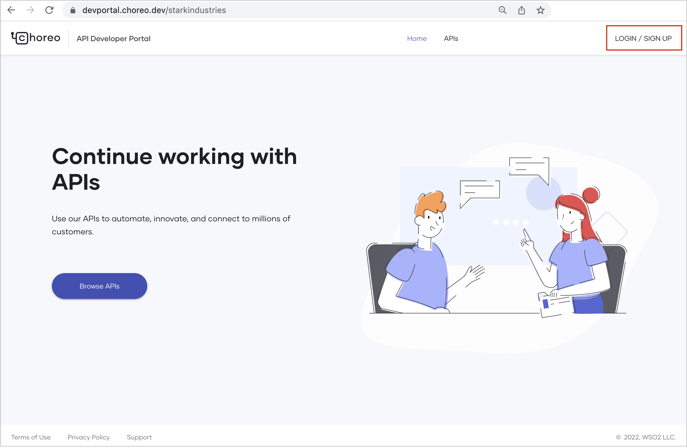
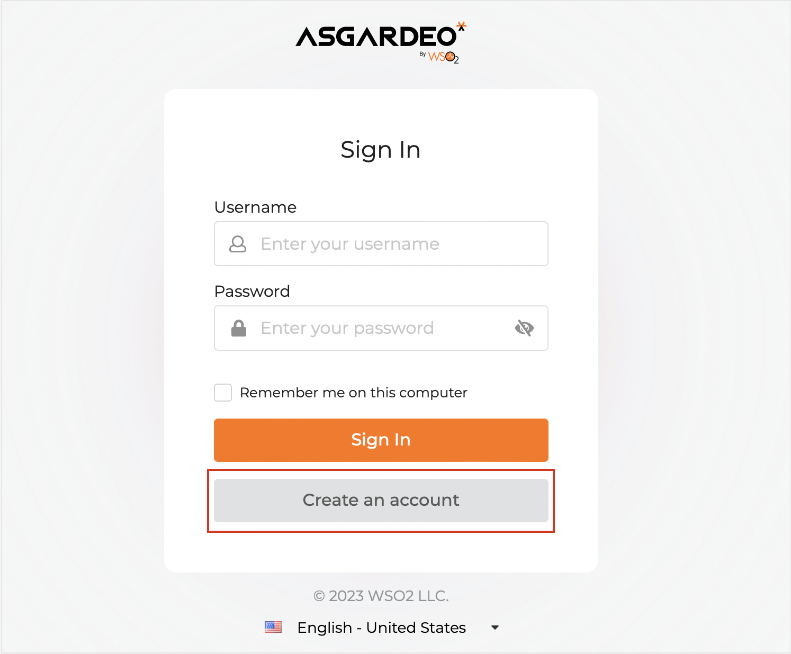

# Configure Self-Sign-Up

With Choreo, you can set up a self-sign-up page for your Developer Portal. The self-sign-up page allows users to create their accounts and gain access to your Developer Portal without requiring any manual intervention to create accounts or provide credentials.

This page walks you through the steps to configure self-sign-up for your Developer Portal.

## Prerequisites

1. Sign in to the Choreo Console at [https://console.choreo.dev/](https://console.choreo.dev/) using your Google, GitHub, or Microsoft account.
2. If you are a new user, create an organization with a unique organization name. For example, "Stark Industries".

## Configure Developer Portal self-sign-up

To configure self-sign-up, follow the steps given below:

1. Send an email to <choreo-help@wso2.com> requesting to configure enterprise IdP for the Developer Portal of your organization. 

    !!! tip
        Ensure you include the organization name or handle in the request.

    !!! note "Sample email"
        Subject : [Stark Industries] Configure enterprise IdP for Developer Portal
        
        Hi CS team,

        I need to configure enterprise IdP for my organization’s Developer Portal to enable self-sign-up. Can you please do the necessary configurations to proceed?

        My organization details are as follows: 

          - Organization name: Stark Industries
          - Organization handle:  starkindustries

        Thank you

    The Choreo support team will perform the necessary configurations and respond to your request.

2. When you receive a response, sign in to [Asgardeo](https://console.asgardeo.io/) using the same credentials that you used to sign in to Choreo.
3. In the Asgardeo Console, click **View all applications**.

    {.cInlineImage-full}

    You will see an application named **WSO2_LOGIN_FOR_CHOREO_DEV_PORTAL**. 

    {.cInlineImage-full}

4. Click on the application to edit it and enter your organization’s Developer Portal URL as the **Access URL** of the application. For example, `https://devportal.choreo.dev/starkindustries`.
5. Click **Update**.
6. To add user attributes, follow these steps:

    !!! info "Note"
          If you have enabled enterprise login and you want to add the **Groups** attribute during self-sign-up configuration, avoid making it mandatory. This ensures proper access control and prevents unauthorized privileges. If you make the **Groups** attribute mandatory, it allows self-signed-up users to specify a group and assume roles associated with it.

    1. Click the **User Attributes** tab.
    2. To add the email as a mandatory user attribute, select **Email** and click the arrow to expand the section. Then, select the **Requested** and **Mandatory** checkboxes.
    3. To add the first name and last name as optional attributes, select **Profile** and click the arrow to expand the section. Then, select the **Requested** checkbox for the **First Name** and the **Last Name** attributes.

        {.cInlineImage-half}

    4. Click **Update**.

7. To add the user attributes as OpenID Connect scopes, follow these steps:

    1. In the top navigation menu, click **Manage** and then click **Scopes** in the left navigation menu.
    2. In the **OpenID Connect Scopes** pane, click **OpenID** to edit it.
    3. Click **+ New Attribute**.
    4. Select **Email**, **First Name**, and **Last Name** as the attributes to associate with the OpenID scope.
    5. Click **Save** and then click **Save Changes**.

        {.cInlineImage-full}

8. To configure basic authentication as the sign-in method, follow these steps:

    1. In the top navigation menu, click **Develop**.
    2. In the **Applications** pane, click the **WSO2_LOGIN_FOR_CHOREO_DEV_PORTAL** application to edit it.
    3. Click the **Sign-in Method** tab and then click **Start with default configuration**.

        {.cInlineImage-full}

    4. Click **Update**.

9.  To configure self-registration, follow these steps:

    1. In the top navigation menu, click **Manage** and then click **Self Registration** in the left navigation menu.
    2. In the **Self Registration** pane, click **Configure**.
    3. To enable self-registration, turn on the toggle.
    4. Select **Account verification**. This displays a confirmation message to enable account verification. 
    5. Click **Continue**.
    6. Specify an appropriate value in the **Account verification link expiry time** field.
    7. Click **Update**. 
     
        {.cInlineImage-full}

Once you complete these steps, you will see a sign up link similar to the following in your Developer Portal:

{.cInlineImage-half}
 
Users can click **LOGIN/SIGN UP** and then click **Create an account** to sign up to access your Developer Portal.

{.cInlineImage-small} 

## Manage new users

To manage users who want to access your Developer Portal via self-sign-up, you have two possible approaches:

- Enable auto-approval for new user registrations: This approach automates the user approval process.  When you enable auto-approval, each user who creates an account and signs up to your Developer Portal can access it by default.
- Manually approve or reject user accounts: This allows you to review the list of user registrations and manually approve or reject each registration as needed.

### Enable auto-approval for new user registrations

To automatically approve each new user account registered on your Developer Portal, follow the steps given below:

1. In the [Choreo Console](https://console.choreo.dev/), click your username in the top right corner.
2. In the drop-down menu, click **Settings**. This opens the **Organization** pane, where you can make necessary changes to organization settings.
3. In the **Organization** pane, click **Self Signups**.
4. To enable auto-approval, turn on the toggle.

Once you enable auto-approval, users can sign in to your Developer Portal and view your APIs and applications immediately after creating an account.

### Manually approve or reject user accounts

If you have not enabled auto-approval, you can manually approve or reject new user registrations. Once a user creates an account, Choreo sends an email to ask the user to confirm the account. To manually approve or reject user accounts, follow the steps given below:

1. In the [Choreo Console](https://console.choreo.dev/), click your username in the top right corner.
2. In the drop-down menu, click **Settings**. This opens the **Organization** pane, where you can make necessary changes to organization settings.
3. In the **Organization** pane, click **Self Signups**. You will see the user accounts listed for approval.
4. To approve a user account, click **Approve**. To reject an account, click **Reject**.

    - If you approve an account, the user will receive an email confirming the approval.
    - If you reject an account, the user will receive an email mentioning that their account is rejected. 

        !!! info "Note"
               A rejected user cannot sign up to your Developer Portal using the same account again.
