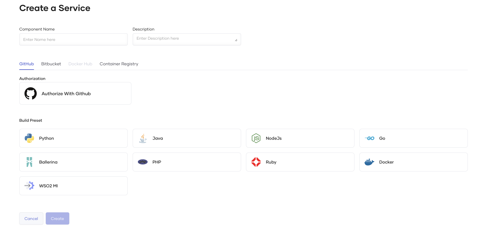
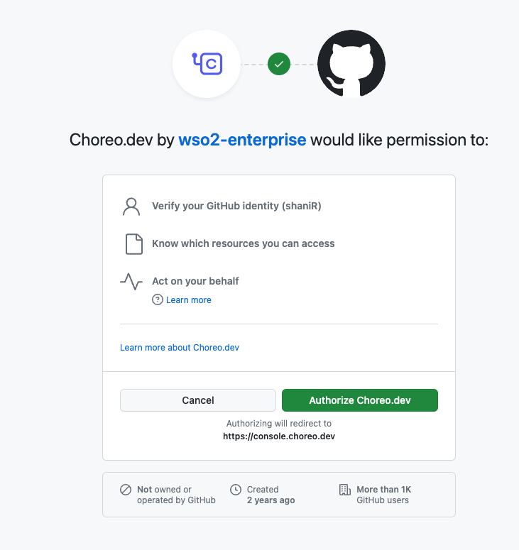
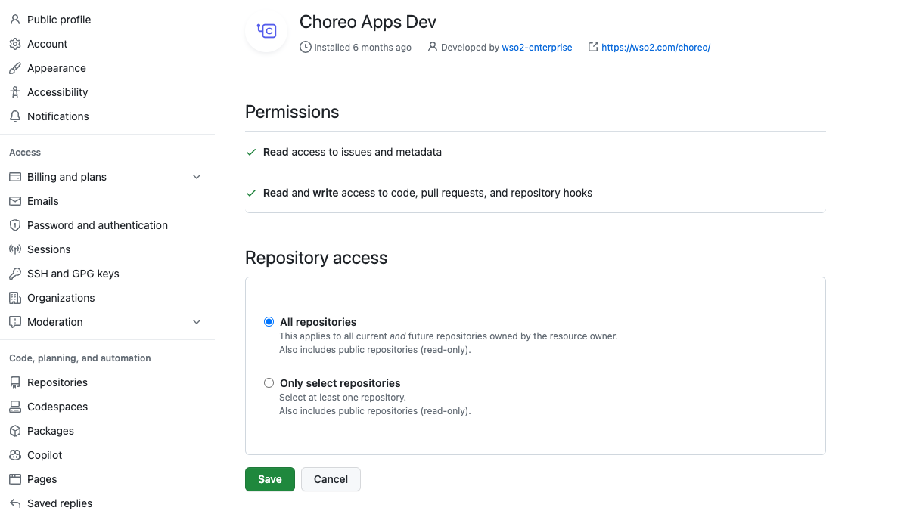
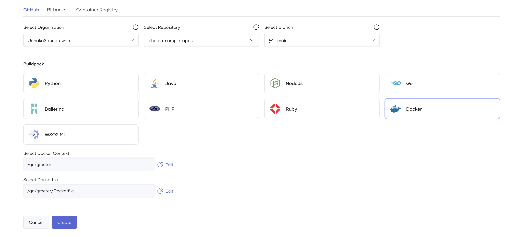
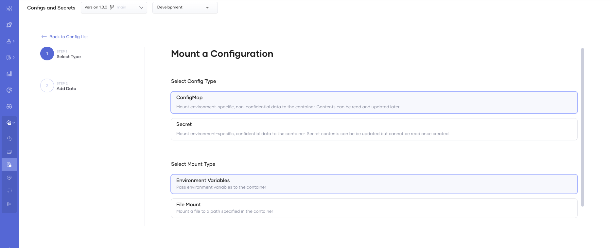
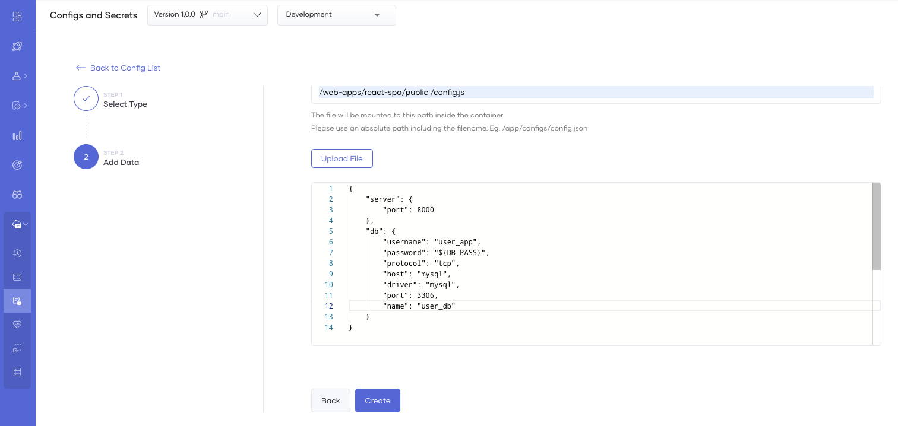

# Deploy a Containerized Application 

Using Choreo, you can easily deploy applications written in different language frameworks (such as Java, Go, NodeJs, Python, etc.) on shared or private data planes using containers.

Choreo supports deploying containerized applications for the following component types:

- Service
- Scheduled Trigger
- Manual Trigger
- Webhook

## Connect your repository to Choreo

To connect your GitHub repository to Choreo, you should authorize the [Choreo Apps](https://github.com/marketplace/choreo-apps) GitHub application to access your account or organization. When you attempt to connect your GitHub repository via the Component creation page, the Choreo Apps authorization prompt will appear.

* Connect GitHub Repository
    
    {.cInlineImage-threeQuarter}

* Authorize GitHub Application
    
    {.cInlineImage-half}

* Grant Repository Access

    {.cInlineImage-full}


    The **Choreo Apps** requires the following permission:
    
    - Read access to issues and metadata
    - Read and write access to code, pull requests, and repository hooks

!!! note
    You can [revoke access](https://docs.github.com/en/authentication/keeping-your-account-and-data-secure/reviewing-your-authorized-integrations#reviewing-your-authorized-github-apps) if you do not want Choreo to have access to your GitHub account. Choreo needs write access only to send pull requests to a user repository. Choreo does not directly push any changes to a repository.

After granting access to the required repositories, you can choose a repository and an associated branch to connect to the Choreo component.
For the containerized application deployments, you should select the **Dockerfile** as the **Buildpack** and provide **Dockerfile Path** and [**Docker Context Path**](https://docs.docker.com/build/building/context/#path-context) for the Docker build.

{.cInlineImage-full}

The following table describes the individual fields in the **Connect Repository** pane.

| **Field**               | **Description**                                                                                                                                                                      |
|-------------------------|--------------------------------------------------------------------------------------------------------------------------------------------------------------------------------------|
| **GitHub Account**      | Your GitHub account or organization. If you want to add another GitHub account, you can expand the list and click **+ Add**.                                                            |
| **GitHub Repository**   | Depending on the repository access you provided, the list will show available repositories to be connected.                                                                                  |
| **Branch**              | The branch of the repository.                                                                                                                                                         |
| **Buildpack**        | Determines the implementation of the component: Ballerina or any other language as a Docker container.                                                                                |
| **Dockerfile Path**     | The path to your Dockerfile. This path is defined relative to the repository root.<br/>For example, if the Dockerfile is at the repository root, the value for this field is `/Dockerfile`. |
| **Docker Context Path** | The Docker build context path. To include the repository root, leave the default `/` value.                                                                                          |
| **Port***               | The port at which your service is running.                                                                                                                                           |
| **OpenAPI Filepath***   | The path to an OpenAPI specification (in YAML/JSON) relative to the repository root. If you don't provide a path, the system automatically generates a default allow-all specification.    |

   
!!! note
 
    - Fields marked with **\*** are not visible for all component types.

    - To successfully build your container with Choreo, it is essential to explicitly define a User ID (`UID`) under the `USER` instruction in your Dockerfile. You can refer to the [sample Dockerfile](https://github.com/wso2/choreo-sample-apps/blob/main/go/rest-api/Dockerfile) for guidance.

    - To ensure that the defined USER instruction is valid, it must conform to the following conditions:
        
        - A valid User ID is a numeric value between 10000-20000, such as `10001` or `10500`.
        - Usernames are not considered valid and should not be used. For example, `my-custom-user-12221` or `my-custom-user` are invalid User IDs.

## Deploy the containerized component

Choreo will automatically apply deployment configurations and settings based on the component type you select during creation.
For example, if you select the **Service** component type, Choreo will deploy it as a Kubernetes deployment with appropriate scaling configurations.

You can run unit tests in the build pipeline by adding the relevant command to the Dockerfile.  For example: 

- [Go-based sample](https://github.com/wso2/choreo-sample-apps/blob/8c18c82db604adb43b89f669888a07cd6e31d7b7/go/rest-api/Dockerfile#L37)
- [Python-based sample](https://github.com/wso2/choreo-sample-apps/blob/8c18c82db604adb43b89f669888a07cd6e31d7b7/python/rest-api/Dockerfile#L15)

### Application configurations

You must provide any required configurations for running the application in the **Configs & Secrets** section of the component's **DevOps** page. Alternatively, you can also review the configurations when you manually deploy via the **Deploy** page.

After clicking the **Create** button, you can select the confidentiality of the configuration and specify how to mount it to the container.

{.cInlineImage-full}

{.cInlineImage-full}

#### Configuration types

* **ConfigMap**: Stores non-confidential data as key-value pairs.
* **Secret**: Stores and manages sensitive information, such as passwords, OAuth tokens, and ssh keys as key-value pairs.

#### Mount types

* **Environment Variables**: Mounts the selected ConfigMap or Secret as an environment variable in the container.
* **File Mount**: Mounts the selected ConfigMap or Secret as a file in the container. Here, the key is the file name, and the value is the file content.

The following image shows adding a **ConfigMap** with **File Mount** mount type to be read by the application.

{.cInlineImage-full}

!!! note
    The JSON file includes ${DB_PASS} as an environment variable defined in a Secret. The application reads the JSON file and substitutes the placeholders with the corresponding environment variables.

### Deployment configurations

Choreo lets you configure deployment settings such as scaling, resource limits, and health checks based on your selected component type.

For more information about these configurations, see Choreo's [DevOps capabilities](../devops-and-ci-cd/view-runtime-details.md).

You can configure the **Endpoints** to expose your service using the **Service** Component in Choreo. See [Service Component](../develop-components/develop-services/develop-a-service.md) for more information. 

### Build, deploy, and promote

After adding the application configuration, you can build and deploy it by clicking the **Deploy Manually** button. Choreo will start the build process with the selected commit in the **Build Area**. 

!!! note
    The **Auto Deploy on Commit** feature, which automatically builds and deploys the application upon pushing a code change to the repository, is enabled by default. To turn off this feature, navigate to the **Build Area** of the **Deploy** page.

Choreo scans your Dockerfile for security vulnerabilities during the build phase, and if there are no issues found, it proceeds with the build process. After building the image, it scans it again for vulnerabilities before deployment to the environment. You can view the build logs from the right-side panel, as shown in the image below.

{.cInlineImage-full}

Once the build process is complete, Choreo will deploy the application automatically to the Development environment. To promote the build to higher environments, you can click the **Promote** button. The number of environment cards visible on the page may vary depending on your environment configurations.

### Troubleshoot security vulnerability scan failures (Trivy)

By default, Choreo utilizes the Aqua Trivy (OSS) image vulnerability scanner to detect security vulnerabilities in all Dockerfile-based build pipelines. The scanner will fail the pipeline if any **CRITICAL** CVEs (Common Vulnerabilities and Exposures) are detected. CVEs of other severity levels are recorded but does not fail the pipeline.

If you cannot fix a critical CVE immediately, you can opt to ignore it. To ignore a critical CVE, add a `trivyignore` (`<docker-build-context-path>/.trivyignore`) file to your build context path. In the file, add the CVEs you need the pipeline to ignore, one entry per line as follows:

```
CVE-2023-xxxx
CVE-2023-yyyy
```

You can add comments in the file by using `#` in front of the comment as follows: 

```
# comments can be added like this
CVE-2023-xxxx
```