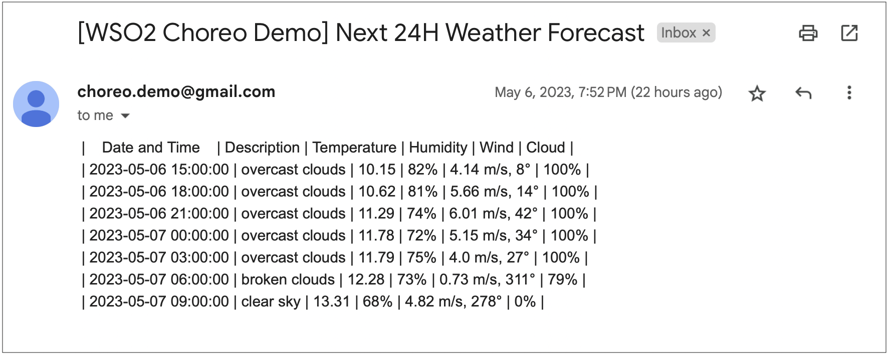
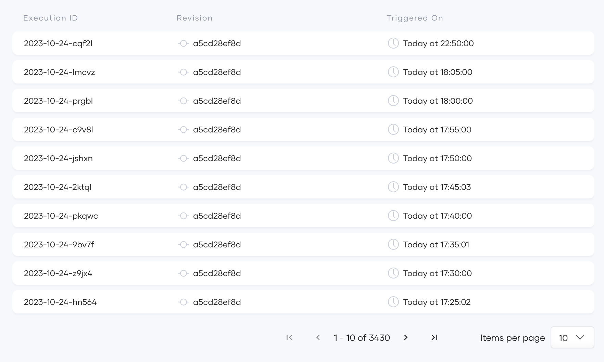
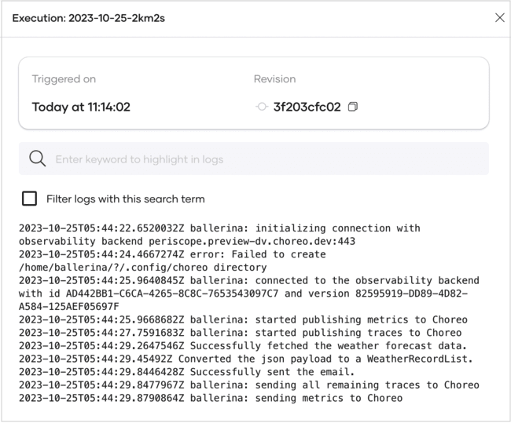

# Develop a Scheduled Integration

Choreo is a versatile integration platform that allows you to create various types of integrations depending on your requirement. 

If you have a requirement to automatically run a specific integration at regular intervals, you can use Choreo to develop a scheduled integration.  This type of integration can automate the synchronization of data between different systems at specified intervals, reducing errors and improving productivity by eliminating the need for manual intervention.

This guide walks you through the steps to develop, deploy, test, and observe a scheduled integration using Choreo.  

In this guide, you will:

  - Develop a scheduled integration to fetch the weather forecast for a specified location for the next 24 hours from the  [OpenWeatherMap](https://openweathermap.org) API.
  - Process the weather data to a specific format.
  - Send the formatted data to a specified email address at a specific time every day.

## Prerequisites

Before you try out the steps in this guide, complete the following:

 - If you are signing in to the Choreo Console for the first time, create an organization as follows:
    1. Go to [https://console.choreo.dev/](https://console.choreo.dev/), and sign in using your Google, GitHub, or Microsoft account.
    2. Enter a unique organization name. For example, `Stark Industries`.
    3. Read and accept the privacy policy and terms of use.
    4. Click **Create**.
       This creates the organization and opens the **Project Home** page of the default project created for you.

 - Fork the [Choreo examples repository](https://github.com/wso2/choreo-examples), which contains the sample integration for this guide.
    
    !!! info "Repository file structure"
         
         To work with the sample repository, it is important to familiarize yourself with the repository file structure. The sample code for this guide is in the `<sample-repository-dir>/integrations/ballerina/weather-to-email-integration` directory. To understand how the functionality is implemented, you must read the code comments. The following table describes what you will find in each file in the repository:

          | **File path**         | **File content**                                                     |
          | --------------------- | -------------------------------------------------------------------- |
          | **Ballerina.toml**    | Contains metadata about the project                                  |
          | **Dependencies.toml** | Lists the dependencies required for the project                      |
          | **main.bal**          | Contains the entry point of the project, including the main function |
          | **types.bal**         | Contains custom data types used in the project                       |
          | **utils.bal**         | Contains utility functions and helper functions used in the project  |
          
 - Go to [OpenWeatherMap](https://openweathermap.org/) and sign up to obtain an API key. For details on how to obtain an API key, see the [OpenWeatherMap documentation](https://openweathermap.org/appid#signup).

## Step 1: Create a scheduled integration component

1. Go to [https://console.choreo.dev/](https://console.choreo.dev/) and sign in. This opens the project home page. 
2. If you already have one or more components in your project, click **+ Create**. Otherwise, proceed to the next step.
3. Go to the **Scheduled Integration** card and click **Create**.
4. Enter a unique name and a description for the component. You can use the name and description given below:

    | **Field**       | **Value**                        |
    | --------------- | -------------------------------- |
    | **Name**        | `WeatherToEmail`                 |
    | **Description** | `My first scheduled integration` |

5. Click **Next**.
6. To allow Choreo to connect to your GitHub account, click **Authorize with GitHub**.
6. If you have not already connected your GitHub repository to Choreo, enter your GitHub credentials, and select the repository you created by forking [https://github.com/wso2/choreo-examples](https://github.com/wso2/choreo-examples) to install the [Choreo GitHub App](https://github.com/marketplace/choreo-apps).

    !!! info
         The **Choreo GitHub App** requires the following permissions:  - Read and write access to code and pull requests.  - Read access to issues and metadata.  You can [revoke access](https://docs.github.com/en/authentication/keeping-your-account-and-data-secure/reviewing-your-authorized-integrations#reviewing-your-authorized-github-apps) if you do not want Choreo to have access to your GitHub account. However, write access is only used to send pull requests to a user repository. Choreo will not directly push any changes to a repository.

8. In the **Connect Repository** pane, enter the following information:

    | **Field**             | **Description**                                |
    | --------------------- | ---------------------------------------------- |
    | **GitHub Account**    | Your account                                   |
    | **GitHub Repository** | `choreo-examples`                              |
    | **Branch**            | **`main`**                                     |
    | **Build Preset**      | **Ballerina**                                  |
    | **Project Path**      | `integrations/ballerina/weather-to-email-integration` |

	!!! tip
    	    - **Build Preset** specifies the type of build to run depending on the implementation of the component. It converts the integration code into a Docker image that can run on Choreo cloud. If an integration is developed using [WSO2 Integration Studio](https://wso2.com/integration/integration-studio/), select **Micro Integrator** as the build preset. If an integration is developed using the [Ballerina language](https://ballerina.io), select **Ballerina** as the build preset. 

          - **Project Path** specifies the location of the project to build the component.

9. Click **Create**. Choreo initializes the component with the sample implementation and opens the **Overview** page of the component.

## Step 2: Deploy the integration

To deploy the integration, follow the steps given below:

1. In the left navigation menu, click **Deploy**.
2. In the **Build Area** card, click **Configure & Deploy**.
3. In the **Configure & Deploy** pane, specify values as follows for the configurable variables:

    !!! tip
        The configurable variables populated here are defined in the sample Ballerina project used in this guide. To learn how to declare configurable variables in Ballerina, see the [Ballerina documentation on declaring configurable variables](https://ballerina.io/learn/by-example/configurable-variables/). If configurable variables are detected in a connected Ballerina project, Choreo prompts for the respective values during component deployment.

    | **Field**     | **Value**                                                               |
    | ------------- | ----------------------------------------------------------------------- |
    | **apiKey**    | The API key you obtained in the prerequisites section                   |
    | **latitude**  | Latitude of the location to get the weather forecast                    |
    | **longitude** | Longitude of the location to get the weather forecast                   |
    | **email**     | The email address to receive the formatted weather forecast information |

4.  Click **Next**. 
5.  In this step, you must define a schedule for the integration. In this guide, let's say you want to receive the weather information daily at 8.00 AM UTC. Enter values as follows to configure the schedule:

    | **Field**            | **Value**                                             |
    | -------------------- | ----------------------------------------------------- |
    | **Select Time Zone** | Select a time zone to schedule the integration        |
    | **Select Range**     | **Day**                                               |
    | **Every**            | `1`                                                   |
    | **At**               | `08:00`                                               |
    
    !!! tip
         - When you develop a scheduled integration, you can define a schedule depending on your requirement. If you want to test and verify the integration immediately, you can schedule the deployment to run in just a few minutes after you create it. However, to avoid unnecessary expenses, make sure you reschedule or stop the deployment once you test and verify.

6. Click **Deploy**. This deploys the scheduled integration to the development environment and indicates the **Scheduled Status** as **Active** in the **Development** card.

   You can test the integration when it runs at the scheduled time. 

## Step 3: Test the integration

When the integration runs at the scheduled time, an email with the subject `[WSO2 Choreo Demo] Next 24H Weather Forecast` is sent from `choreo.demo@gmail.com` to the email address specified as the **email** configurable variable value in [Step 2](#step-2-deploy-the-integration). 

If the integration ran successfully, you should receive an email similar to the following to the email address you specified:

## Step 4: Observe the integration

The observability view in Choreo displays graphs that depict details such as throughput, latency, diagnostic data, and logs to identify and troubleshoot anomalies in components you deploy.

To visualize and monitor the performance of the scheduled integration component you deployed, click **Observability** in the left navigation menu. You can observe the following:

 - The throughput and latencies of requests served over a given period.
 - The logs that are generated over a given period.
 - The flame graph (Diagnostics View) that is generated over a given period.
 - The low-code diagram.
  
To learn more about the observability details you can view via Choreo observability, see [Observability Overview](../../monitoring-and-insights/observability-overview.md).

## Step 5: Monitor executions

To track and monitor executions associated with the deployed scheduled task, go to the left navigation menu and click **Execute**. 

!!! tip
     The **Execute** view is applicable to both scheduled and manual tasks.

You can view the following information:

- The total number of executions within the past 30 days.

    

- The currently active executions and those that are already complete.
  
    Here, you can view information such as the execution ID, the revision of the execution, and the time it was triggered.

    

- Detailed execution logs for a specific execution.

    You can click on an execution to view detailed logs related to it.
    
    !!! info
         
         It may take a few minutes for the logs to appear. You may need to manually refresh to view the latest logs.

     
