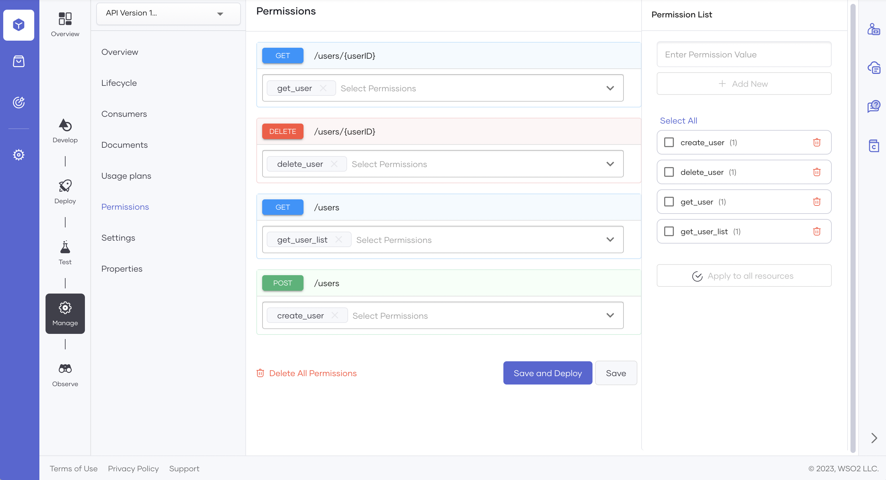
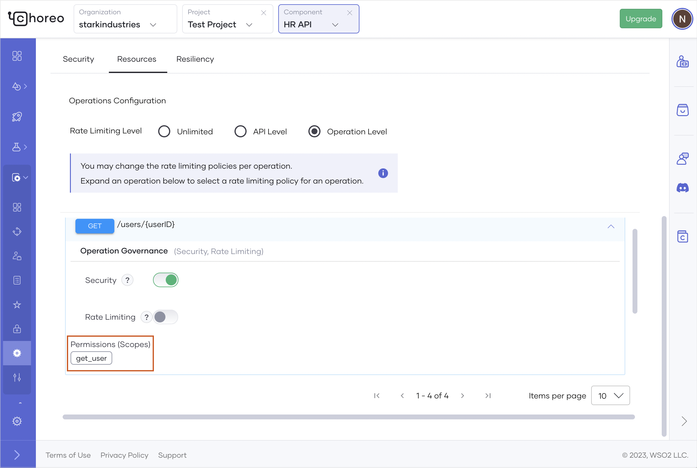
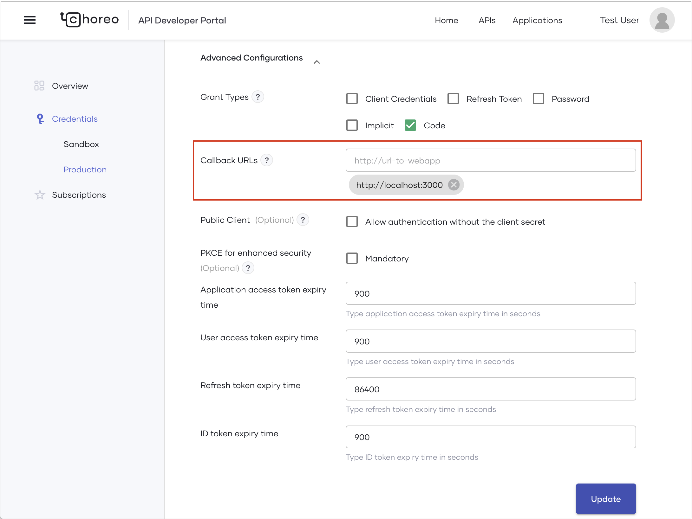
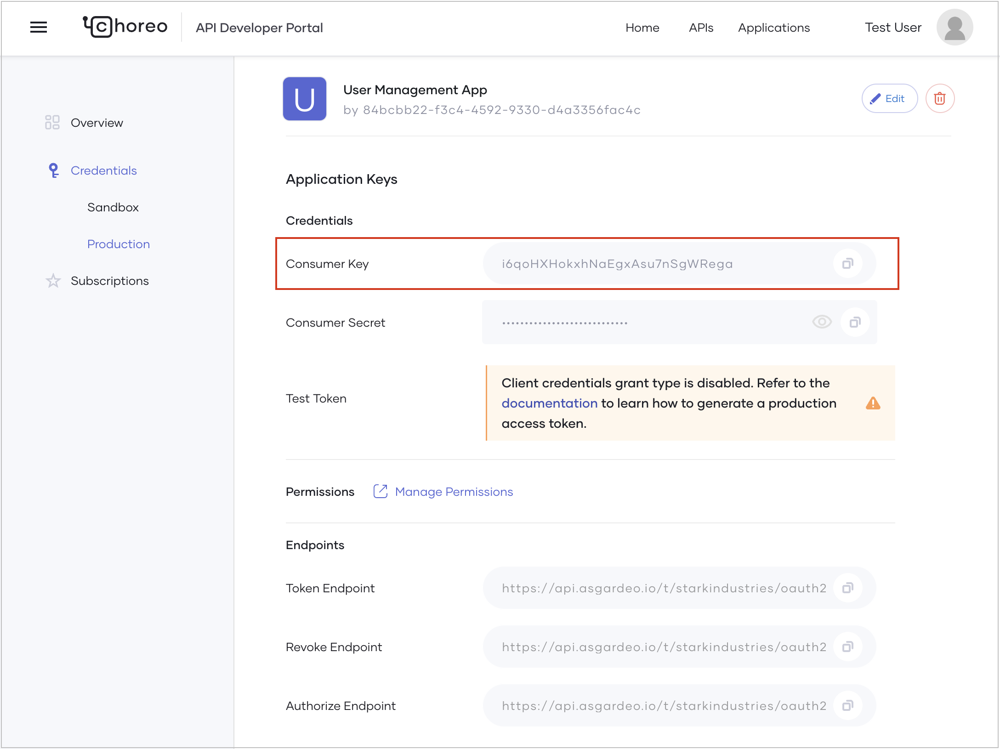
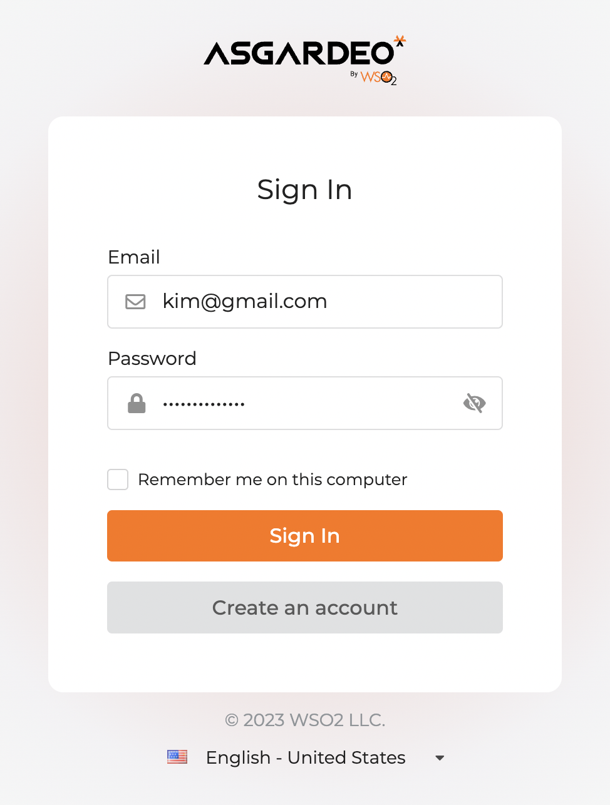
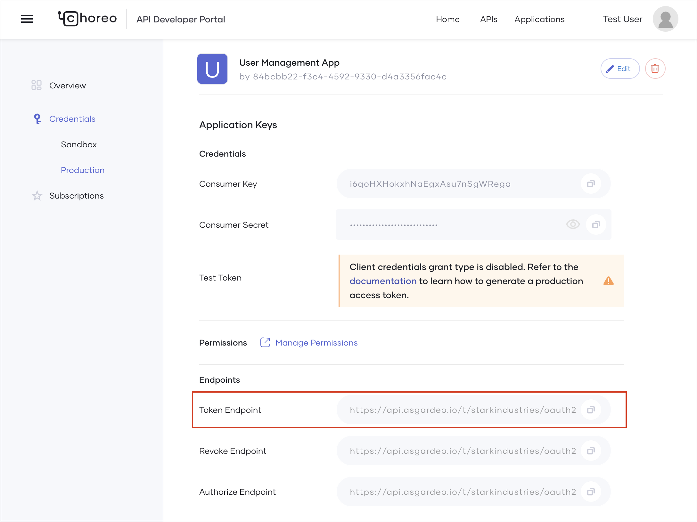
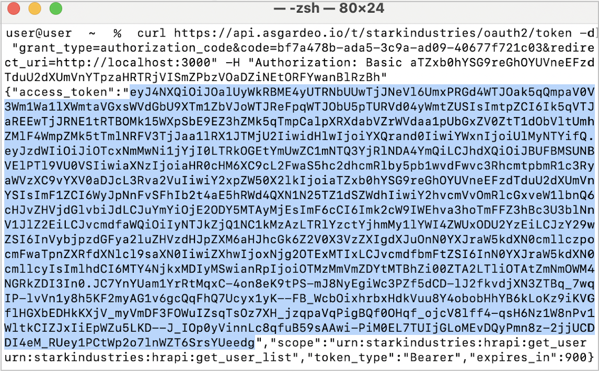
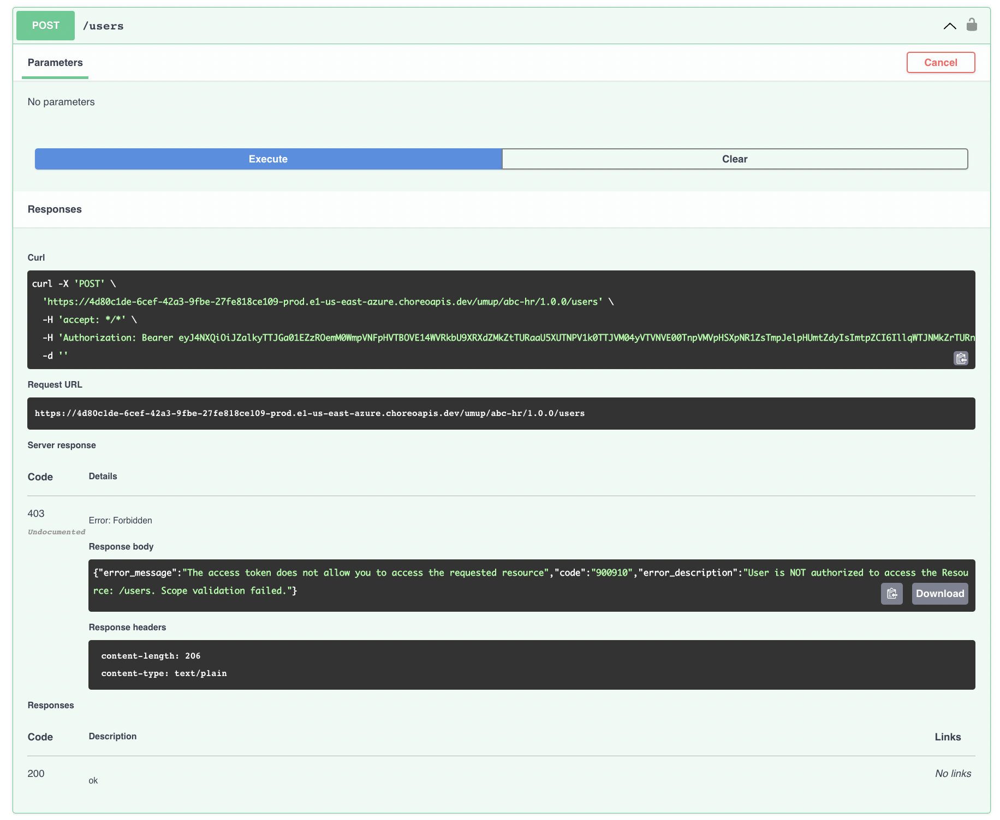

# Secure an API with Role-Based Authorization

Role-based authorization is a crucial security mechanism that provides the necessary access controls to ensure the security and integrity of API resources. In this approach, each user or group is assigned a specific role that determines the actions they are authorized to perform on an API resource.

This tutorial explains how to implement role-based authorization using Choreo and Asgardeo. It includes a real-world scenario and practical steps to create and publish a REST API proxy component in Choreo and apply role-based access control.

## Scenario

An organization needs to implement a user management service to keep track of users. The service needs to perform the following four operations:

  - List existing users
  - List a user
  - Create new users
  - Delete a user

There are two types of users in the organization:

  - Human Resource Manager (HR manager)
  - Human Resource Officer (HR officer)

Each user type requires different levels of access to the user management service.

  - The HR manager must have permission to perform the following operations: list existing users, list a user, create new users, and delete a user.
  - The HR officer must have permission to perform the following operations: list existing users and list a user.

## Implement role-based access control with Choreo and Asgardeo

Let’s take a look at the steps to follow to implement the scenario described above using Choreo and Asgardeo.

### Prerequisites

If you created your Organization in Choreo before 21st of February 2023, follow these steps to enable Asgardeo as the default key manager:
  
!!!tip

     If you created your Organization in Choreo after the 21st of February, 2023, Asgardeo will be the default key manager.

   1. Go to the Choreo Console, click **Settings**, and then click **API Management**.
   2. On the **API Management** page, click **Enable Asgardeo Key Manager**.

       {.cInlineImage-threeQuarter}.
  
    !!!info

            Enabling Asgardeo as the default key manager has the following effects:

            - Existing applications created via the Developer Portal in your Organization will continue to function as usual. However, any new application you create within the Organization will use Asgardeo as the key manager.
            - New grant types such as **Password**, **Authorization Code**, **PKCE**, and **Implicit**, which were not available in Choreo will become available.
            - The capability to add an external IdP will be disabled because Asgardeo does not support token exchange. However, you can use the federation capabilities of Asgardeo to achieve similar functionality.


### Step 1: Create a REST API proxy component and deploy it

Follow these steps to create a REST API proxy component, add resources, and deploy it:

1. To create a REST API proxy component, see the instructions under [step 1](../tutorials/create-your-first-rest-api-proxy.md#step-1-create-a-rest-api-proxy) in the Create Your First REST API Proxy tutorial.
2. In the **Develop** view, click **Resources**, and follow these steps to add resources:

     - Select **GET** as the **HTTP Verb**, enter `/users` as the **URI Pattern**, and click **+** to add the resource.
     - Select **GET** as the **HTTP Verb**, enter `/users/{userID}` as the **URI Pattern**, and click **+** to add the resource.
     - Select **POST** as the **HTTP Verb**, enter `/users` as the **URI Pattern**, and click **+** to add the resource.
     - Select **DELETE** as the **HTTP Verb**, enter `/users/{userID}` as the **URI Pattern**, and click **+** to add the resource.
     
3. Click **Save**. The API resources will be as follows:

    {.cInlineImage-full}

4. In the left navigation menu, click **Deploy**.
5. Go to the **Build Area** card and click **Configure & Deploy**. The **Configure & Deploy** pane opens with the endpoint populated as `https://samples.choreoapps.dev/company/hr`.
6. Click **Save & Deploy**.

### Step 2: Apply permission to resources and publish the API

Follow these steps:

1. In the left navigation menu, click **Manage**, and then click **Permissions**. 
2. In the **Permissions** pane, click **+ Add Permission**.
3. Follow these steps to add the permission values to the permission list:
   - In the Permission List pane, enter `get_user_list` as the permission value and click **+Add New**.
     Similarly, add `get_user`, `create_user`, and `delete_user` as permission values.
4. Select the permission values as follows for each of the resources:

    {.cInlineImage-full}

5. Click **Save and Deploy**. 
Now you are ready to promote the API to production.
6. In the left navigation menu, click **Deploy**.
7. Go to the **Development** card and click **Promote**.  The **Configure & Deploy** pane opens with `Use Development Endpoint Configuration` selected by default.
8. Click **Next** to promote the API to production. Now you can publish the API.
  
    !!!note

            To verify whether the permission(scope) values have been applied to the resources, click **Settings**, then click the **Resources** tab, expand a resource, and check the attached permission value.

            {.cInlineImage-full}

9. In the **Manage** view, click **Lifecycle**.
10. In the **Lifecycle Management** pane, click **Publish**.
    A message appears where you can specify whether you want to publish a connector for this REST API proxy. Creating a connector for this REST API proxy makes it available in the Marketplace. 
11. Click **No, Thanks**. This changes the status of the API to `Published`.

Now the REST API proxy is ready to be consumed. An application developer can discover the API, subscribe to it and then invoke it.

### Step 3: Subscribe to the Published API

In this step, you take the role of an application developer who consumes the published REST API.
To consume the REST API, you must create an application, generate keys, and subscribe to the API.

Follow these steps:

1. Go to the [API Developer Portal](https://devportal.choreo.dev/) and click **Applications** on the top menu.
2. Click **Create**.
3. Enter `User Management App` as the **Application Name**, select **10PerMin** as the **Per Token Quota**, and then click **Create**. This creates the application and takes you to the application overview page.
4. On the left navigation menu, click **Production Keys**.
5. Click to expand **Advanced Configurations** and follow these steps to generate credentials for the application:
    1. Select **Code** as the grant type.
    2. Enter the hosted URL of the application as the **Callback URL**.
    3. Click **Generate Credentials**.
6. To Subscribe to the API follow these steps:
    1. On the left navigation menu, click **Subscriptions**.
    2. In the Subscription Management pane, click Add APIs.
    3. In the **Add APIs** list, go to the API you created, and click **Add**.

### Step 4: Define roles and assign them to groups

Follow these steps:

1. Click **Manage Permission** on the top right. This takes you to the **Roles** tab in Asgardeo, where you can add applicable roles.
2. Follow these steps to add roles:
    1. Click **+ New Role**,  enter `admin` as the **Role Name** and click **Next**.
    2. Select all four permission values listed, and then click **Finish**.
    3. Similarly, add another role with `user` as the Role Name and `get_user_list`, and `get_user` as Role Permissions.
    
    Now you can proceed to create groups.
    
3. Click **Manage** on the top menu, then click **Groups** on the left navigation menu.
4. Follow these steps to add groups:
    1. Click **+ New Group**,  enter `HR-Manager` as the **Group Name** and click **Finish**. 
    2. Similarly, add another group with `HR-Officer` as the **Group Name**.

   Now you are ready to assign roles to groups.

5. Follow these steps to assign roles:
    1. Click to edit the **HR-Manager** group.
    2. Click the **Roles** tab and then click **+Assign Roles**.
    3. Select **admin** and click Save.
    4. Similarly, assign the **user** role to the **HR-Officer** group.

### Step 5: Define users and assign them to groups

Follow these steps:

1. Define two users named `John` and `Kim`.  For step-by-step instructions on adding a user, see [Manage users](https://wso2.com/asgardeo/docs/guides/users/manage-customers/#onboard-a-user) in the Asgardeo documentation.
2. Assign `John` to the **HR-Manager** group and assign `Kim` to the **HR-Officer** group. For step-by-step instructions on assigning a user to a group, see [Assign groups](https://wso2.com/asgardeo/docs/guides/users/manage-customers/#assign-groups) in the Asgardeo documentation.

### Step 6: Obtain an access token and try out the API

Follow these steps:

1. Construct the authorization URL as follows by replacing the placeholders with appropriate values:

     ```
     <authorize_URL>?response_type=code&client_id=<clientID>&redirect_uri=<redirect_URL>&scope=<scopes>
     ```

    - Replace `<authorize URL>` with the URL populated as the **Authorize Endpoint** in the **Application Keys** pane.

        {.cInlineImage-full}

    - Replace <redirect_URL> with the value specified as the **Callback URL** under **Advanced Configurations** in the **Application Keys** pane.

        {.cInlineImage-full}

     - Replace `<scopes>` with the scopes applicable to the user. Here let’s use the scopes applicable to user `Kim`.
     - Replace `<clientID>` with the value populated as **Consumer Key** in the **Application Keys** pane.

        {.cInlineImage-full}

2. Open the constructed URL via a web browser. This will take you to a sign-in page provided by Asgardeo.

      {.cInlineImage-small}

3. Sign in with credentials of `Kim` and click **Allow** to approve the consent.

      {.cInlineImage-small}

    This redirects you to the callback URL of the application. The URL includes a code as a query parameter.

       {.cInlineImage-half}

4. Copy the code and use it to replace `<code>` in the following command to invoke the authorization code grant token request:

     ```
     curl <token_url> -d "grant_type=authorization_code&code=<code>&redirect_uri=<redirect_uri>" -H "Authorization: Basic <base64(clientId:clientSecret)>"
     ```

    - Replace `<token_url>` with the URL populated as the **Token Endpoint** in the **Application Keys** pane.

           {.cInlineImage-full}

    - Replace `<redirect_uri>` with the value specified as the **Callback URL** under **Advanced Configurations** in the **Application Keys** pane.
    
    - Use a base64 encoder to encode your client ID and client secret in the following format and replace `<base64(clientId:clientSecret)>` with the encoded value:

        **`<clientId>:<clientSecret>`**
  
        !!!note

                WSO2 does not recommend the use of online base64 encoders for this purpose.

5. Extract the access token from the response that you get.

      {.cInlineImage-full}

6. Go to the [API Developer Portal](https://devportal.choreo.dev/), try out the HR API using the access token you extracted, and observe the responses.

    You’ll observe that it is only possible to access the following resources because the access token only contains the scopes for those:

    - GET /users
    - GET /users/{userID}

    Trying out the following resources results in a scope validation failed response because the token doesn’t include the scopes for those resources:

    - DELETE /users/{userID}
    - POST /users

        {.cInlineImage-full}    

   Similarly, if you use John’s credentials and sign in to obtain an access token, you'll observe that you can invoke all four resources because it would contain all the required scopes.

Congratulations! You have successfully implemented role-based access control with Choreo and Asgardeo.
