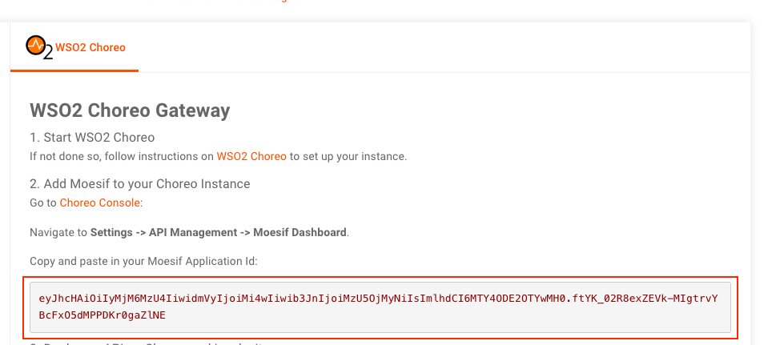

# Integrate Choreo with Moesif

Moesif is an API analytics and monetization service that helps you grow your API products. You can integrate Choreo with Moesif and gain valuable insights into your API's usage.  While Moesif's API analytics capabilities empower you to make informed decision-making on behalf of your organization, its monetization options simplify revenue generation from your APIs, eliminating the need for complex coding. 

In this guide, you will:

- Generate a key in Moesif.
- Configure Choreo to connect to Moesif.
- Invoke an API and observe the insights on the Moesif dashboard. 

## Step 1: Generate an API key in Moesif

Let's generate an API key in Moesif. 
If you're an existing Moesif user with a registered organization, proceed to [step 1.2](#step-12-access-the-api-key-in-moesif-as-an-existing-user).

### Step 1.1: Generate a key in Moesif as a new user 

If you are a new user, follow the steps below to register an organization and generate a key:

1. Go to [https://www.moesif.com/](https://www.moesif.com/).
2. Click **Sign Up** and select an authentication option and proceed. 
3. On the **Get Started** page, enter meaningful values for the fields and create a new organization. 

    | Field                 |  Description                                            |
    |-----------------------|---------------------------------------------------------|
    | **Organization Name** |  The name of your company or team.                      |
    | **Application Name**  | An application represents one project or environment.   |

 4. Click **Next**.
 5. On the **Overview** page, click **Next**.

     This opens the **Quick Install** page. As there is no data, we cannot proceed. Let's configure Moesif to receive data from Choreo. 

 6. Select a **WSO2 Choreo** as the **Server Integration**
 7. Copy the **Application Id**. 
    
     
     

### Step 1.2: Access the API key in Moesif as an existing user

If you are an existing user with a registered organization, or you do not have an API key for the organization you created,  follow the steps below to access the generated API key:

1. Go to [https://www.moesif.com/](https://www.moesif.com/).
2. Click on your profile in the bottom left corner, and navigate to the **API Keys** page.
3. Copy the **Collection Application Id**.

## Step 2: Integrate Choreo with Moesif

Let's configure Choreo to publish events to Moesif.

1. Go to [https://console.choreo.dev/](https://console.choreo.dev/cloud-native-app-developer) and sign in.
2. On the left navigation, click **Settings**. 

    !!! info
        Be sure to **not have a project selected**. If you have a project selected, close the project list on the header of the Choreo Console.

3. Click the **API Management** tab, and click **Moesif Dashboard**.
4. Paste the **Application Id** you copied. 
5. Click **Add**.

Once you successfully add the key, you will see a delete option next to it. Currently, you can only configure one API key. If you need to add a new API key, you need to delete the existing key and add the new one. 

!!! Note
    Once you configure the Moesif API key on Choreo, **wait for five minutes before you publish any data to the Moesif** API analytics platform. 

## Step 3: Invoke an API and observe the data on the Moesif Dashboard 

You have configured Choreo to publish data to Moesif. Let's see how you can view the insights on Moesif.

!!! tip
    - If you have not created an API and deployed it on Choreo, you can follow the [create and deploy a REST API](https://wso2.com/choreo/docs/develop-components/develop-services/develop-a-rest-api/) guide to get started.

1. Invoke your API by following the [Test REST Endpoints via the OpenAPI Console](https://wso2.com/choreo/docs/testing/test-rest-endpoints-via-the-openapi-console/) guide. 

2. Once you publish data, your Moesif dashboard will receive events. Once Moesif receives events, you will see a notification on Moesif confirming that it received data. 

    {.cInlineImage-small}

3. Click **Next** on the notification. This will take you to the final step, where you can opt to add team members. In this guide, let's skip this step. 
4. Click **Finish**.

You can now view your API's insights in the Moesif dashboard. 
