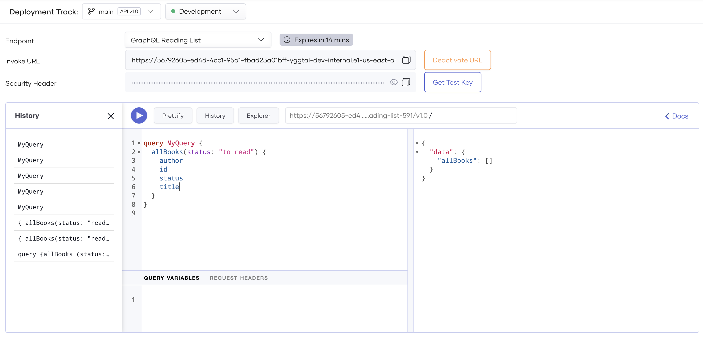

# Test GraphQL Endpoints via the GraphQL Console

Choreo provides an integrated GraphQL Console to test publicly exposed GraphQL endpoints of Service components you create and deploy. The GraphQL Console allows you to write queries and mutations interactively. As Choreo uses OAuth2.0 authentication by default to secure GraphQL APIs, the GraphQL Console generates test keys to test APIs.

## Public Endpoints

1. Sign in to the [Choreo Console](https://console.choreo.dev/).

2. In the **Component Listing** pane, click on the component you want to test.

3. Click **Test** in the left navigation menu and then click **Console**. This opens the **GraphQL Console** pane.

4. In the **GraphQL Console** pane, select the environment from the drop-down list.

5. Select the required endpoint from the **Endpoint** list.

    !!! note
        You have set the **Network Visibility** to **Public** in the **endpoints.yaml** to declare an endpoint as a public endpoint.

6. Enter the API path and the query or mutation you want to test.

7. Click the play icon.

    !!! tip
        If you want to generate a required query or mutation for testing via the GraphQL Explorer, click **Explorer** to open the GraphQL Explorer.

   {.cInlineImage-full}

## Organization Endpoints

1. Sign in to the [Choreo Console](https://console.choreo.dev/).

2. In the **Component Listing** pane, click on the component you want to test.

3. Click **Test** in the left navigation menu and then click **Console**. This opens the **GraphQL Console** pane.

4. In the **GraphQL Console** pane, select the environment from the drop-down list.

5. Select the required endpoint from the **Endpoint** list.

    !!! note
        You have to set the **Network Visibility** to **Organization** in the **endpoints.yaml** to declare an endpoint as an organization endpoint.
        
6. Click on **Generate URL** to generate a temporay test URL that will be active for 15 minutes.

    !!! note
        The temporay test URL will be available **only for 15 minutes** and it will get expired after. You can deactivate the test URL by clicking on the **Deactivate URL** button.

7. Enter the API path and the query or mutation you want to test.

8. Click the play icon.

    !!! tip
        If you want to generate a required query or mutation for testing via the GraphQL Explorer, click **Explorer** to open the GraphQL Explorer.

{.cInlineImage-full}
